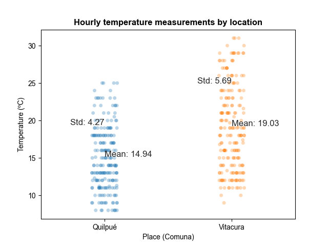

# Comparing temperatures between two places ("Comunas")

## Context

We are using [Airflow](https://airflow.apache.org/docs/apache-airflow/stable/tutorial/index.html) to run an API query every hour (I know this is overkill 😊)

Here are the steps to take to get airflow 2.0 running with docker on your machine. 
1. Clone this repo

1. Install docker desktop application if you don't have docker running on your machine
- [Download Docker Desktop Application for Mac OS](https://hub.docker.com/editions/community/docker-ce-desktop-mac)
- [Download Docker Desktop Application for Windows](https://hub.docker.com/editions/community/docker-ce-desktop-windows)

## Obtain API Key for weather data

- Go to [this url](https://www.weatherapi.com/) and get yours
- Save the API Key in an .env file (We are using dotenv): Check *dag_with_python_weather.py* for details 

## Docker instructions

1. Launch airflow 
   ```bash
   docker-compose up -d airflow-init
   ```
   
2. Launch airflow services by docker-compose
    ```bash
    docker-compose up -d
    ```

3. Check the running containers
    ```bash
    docker ps
    ```

4. Go to `localhost:8080`

5. Check that the dag named *dag_with_python_weather* is running

## Temperature measurements in December 2023



## Pending work

- [ ] Fix relative paths
- [ ] Improve plots
- [ ] Persist records in a database
